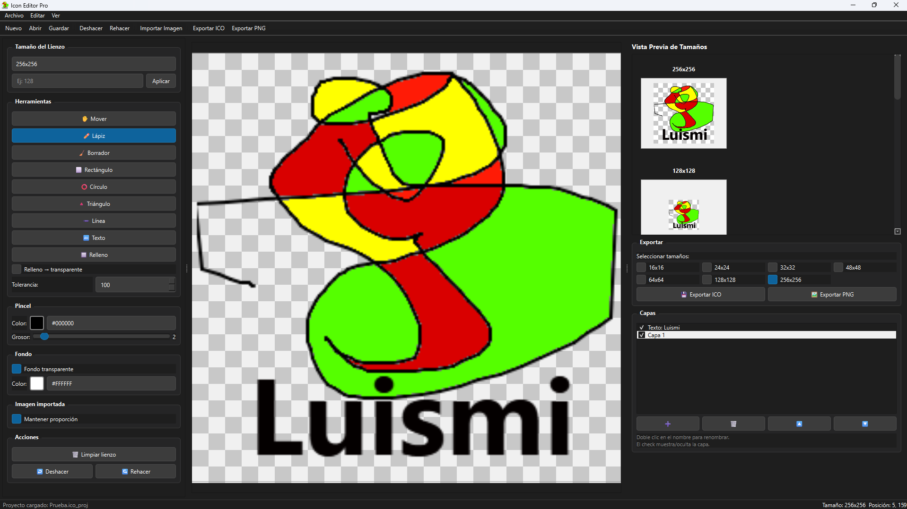

# 🎨 Icon Editor Pro

Editor de iconos por capas para Windows/Linux/macOS, hecho con **Python** y **PySide6**. Dibuja, importa imágenes, añade texto, organiza todo en capas independientes y exporta directamente a `.ico`, `.png` en varios tamaños a la vez.


-green)


---

## ✨ Características

- **Sistema de capas al estilo editor de imágenes**: cada figura, texto o imagen importada se coloca en su propia capa. Selecciona, mueve, redimensiona o reedita cualquier objeto en cualquier momento, sin importar cuándo lo creaste.
- **Herramientas de dibujo**: lápiz, borrador (con borrado real a transparente), línea, rectángulo, círculo, triángulo y relleno por inundación (con tolerancia de color ajustable y opción de vaciar a transparente).
- **Herramienta de texto** con tipografía, tamaño, negrita, cursiva, subrayado y color — completamente reeditable después de insertado.
- **Importación de imágenes** (PNG, JPG, BMP, GIF, TIFF, WEBP) como objetos flotantes que puedes mover y redimensionar antes de fijarlos.
- **Panel de capas**: añadir, eliminar, reordenar (subir/bajar), mostrar/ocultar y renombrar capas.
- **Deshacer/rehacer independiente por capa**.
- **Fondo transparente o de color**, configurable en cualquier momento sin afectar al contenido de las capas.
- **Vista previa en vivo** a los tamaños de icono más habituales (256, 128, 64, 48, 32, 24, 16 px), a escala real.
- **Exportación** a `.ico` (con varios tamaños embebidos en un mismo archivo), `.png`.
- **Proyectos guardados** (`.ico_proj`) que conservan todas las capas, su orden, visibilidad, y el contenido editable de los textos — no solo la imagen final.
- **Tema claro/oscuro** intercambiable desde el menú *Ver*.
- Lienzo redimensionable (16 a 256 px o tamaño personalizado) y cursor de pincel que refleja el grosor real de la herramienta.

## 📸 Capturas

> 


## 🚀 Instalación

Requiere **Python 3.10 o superior**.

```bash
# Clona el repositorio
git clone https://github.com/Zontro01/icon_editor_pro.git
cd icon_editor_pro

# (Recomendado) crea un entorno virtual
python -m venv venv
source venv/bin/activate      # Linux/macOS
venv\Scripts\activate         # Windows

# Instala las dependencias
pip install -r requirements.txt
```

## ▶️ Uso

```bash
python main.py
```

### Flujo básico

1. Elige el tamaño del lienzo (o uno personalizado) en el panel izquierdo.
2. Dibuja con el lápiz, formas o texto — cada forma/texto/imagen crea su propia capa automáticamente.
3. Usa la herramienta **✋ Mover** para seleccionar y ajustar cualquier objeto ya creado, en cualquier momento.
4. Organiza las capas desde el panel de la derecha (subir, bajar, ocultar, renombrar).
5. Revisa la vista previa a los distintos tamaños de icono.
6. Exporta desde *Archivo* a `.ico`, `.png`, o guarda el proyecto completo (`.ico_proj`) para seguir editándolo más adelante.

## 🗂️ Estructura del proyecto

```
icon_editor/
├── main.py                 # Punto de entrada de la aplicación
├── main_window.py          # Ventana principal, menús, paneles y su lógica
├── canvas.py                # Lienzo: dibujo, capas, historial, herramientas
├── layer.py                 # Clase Layer (imagen + nombre + visibilidad + historial propio)
├── text_tool.py              # Diálogo de inserción/edición de texto
├── image_importer.py         # Importación de imágenes externas
├── icon_exporter.py           # Exportación a .ico / .png 
├── project_manager.py         # Guardado/carga de proyectos (.ico_proj)
├── preview_widget.py           # Tarjetas de vista previa por tamaño
├── tools/
│   ├── drawing_tools.py        # Lápiz, borrador, relleno
│   └── shape_tools.py          # Formas geométricas
├── ui/
│   └── styles.py                # Hojas de estilo (tema claro y oscuro)
├── recursos/
│   └── icono_aoo.png                # Icono de la aplicación
│   └── screenshot.png                # Captura de imagen de la aplicación
├── requirements.txt
└── README.md
```

## 🧰 Formatos de exportación

| Formato | Extensión   | Notas                                        |
|---------|-------------|-----------------------------------------------|
| Icono Windows | `.ico` | Puede incluir varios tamaños en varios archivos |
| PNG     | `.png`      | Con transparencia real                         |

## 📄 Proyectos (`.ico_proj`)

Los proyectos se guardan como JSON con todas las capas por separado (imagen en PNG/base64, nombre, visibilidad, y en el caso de los textos, también su contenido y formato originales para poder seguir editándolos). Son compatibles hacia atrás: un proyecto antiguo de una sola imagen se sigue pudiendo abrir con normalidad.

## 🗺️ Ideas pendientes / no implementadas

- Herramientas de forma adicionales (estrella, polígono, rectángulo redondeado, flecha) — el motor ya las soportaría con poco esfuerzo.
- Filtros de desenfoque/nitidez (el código existe en `tools/drawing_tools.py` pero no está conectado a ningún botón).

## 🤝 Contribuir

Las *pull requests* son bienvenidas. Para cambios grandes, abre antes un *issue* para discutir qué te gustaría cambiar.

## 📝 Licencia

[MIT](LICENSE)
